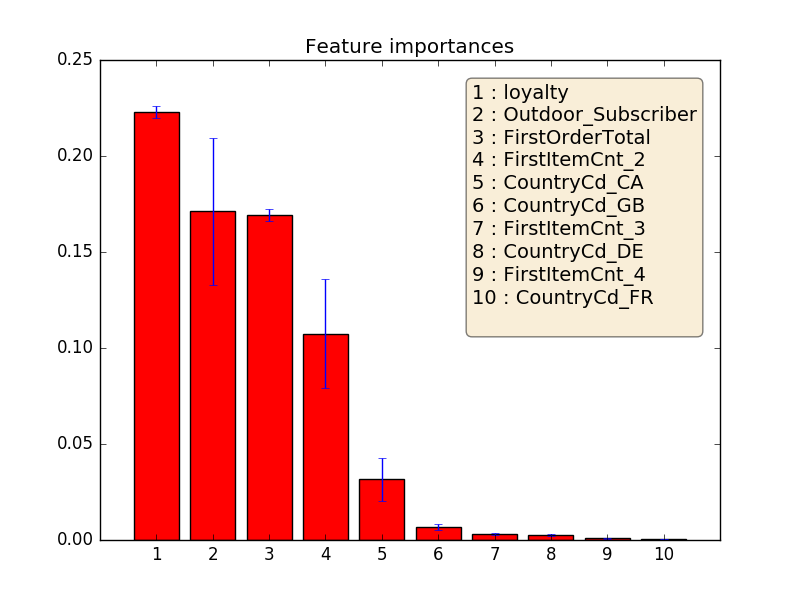
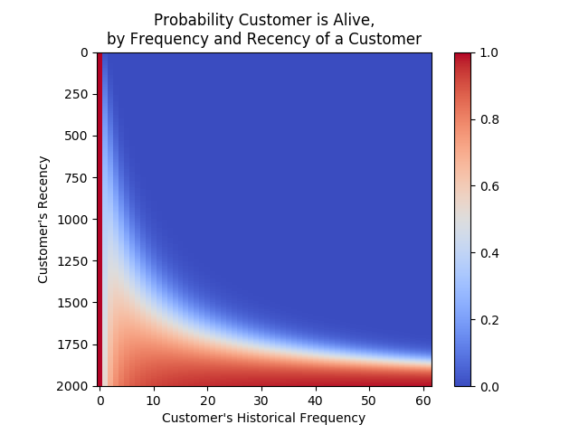
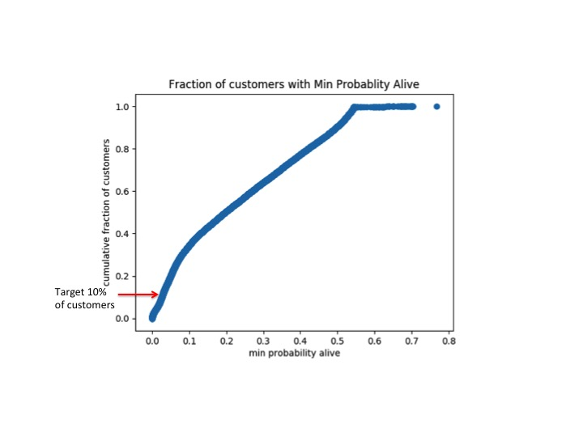
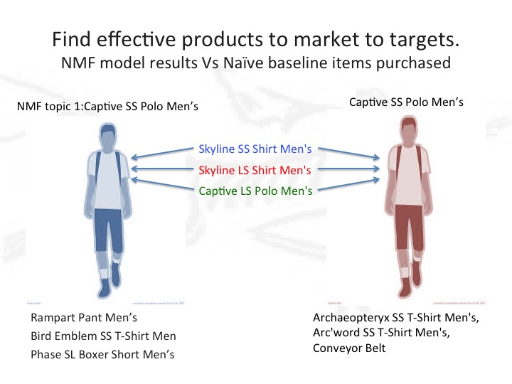

# Arc'nalysis

The aim of targeted marketing for any company is first identifying a target customer and then being able to suggest a reasonable and interesting purchase option in a timely manner.

With customer, sales, and product descriptor data obtained from an outdoor clothing and sporting goods company Arc'teryx I wanted to help them better understand their customers by providing Customer Lifetime Value calculations and Market Basket analysis.

## Logistic Regression and Random Forest Classification

### Logistic Regression

There were a large number of single-sales customers who visited the website, so the first method of analysis applied was a logistic regression to assess and quantify the effect that each of the variables of interest had on the probability that a customer was a single purchaser vs a repeat purchaser.
Variables engineered:
loyalty: time since first purchase
CountryCd: dummy variables for 14 countries
FirstItemCnt: dummy variables for number of items in first purchase
Outdoor_Subscriber: customer subscribed to the outdoor newsletter

Classes were balanced using SMOTE before modeling procedures were applied. Logistic regression accuracy scores were low (0.57), but better than baseline predictions that guessed 50/50 at the single purchase/second purchase customer classes.

### Random Forest Classifier

All variables were included in a random forest classifier, and the model provided improved accuracy and recall scores over the logistic regression model.
Top 10 feature importances shown below and are used in the Customer Lifetime Value Analysis (customer history and spending).
  

    
  

## Customer Lifetime Value and Topic-Modeling

### Customer Lifetime Value (CLV) - using customer histories for marketing purposes

Using a Beta-Geometric model, customer recency and frequency was used to calculate the probability that a customer was active/alive and is shown in aggregated form:
  

    
  

Disaggregating the matrix and looking at individual customer histories, shows differing buying patterns. At the low points of the customer history plots are the lowest probability at which the customer is active/alive to the business. Aggregating this information and looking at a cumulative proportion of customers who have a minimum probability of being active below a pre-chosen probability of being active would give a population of customers that could receive marketing.
  

    
  

### Non-Negative Matrix Factorization to find product topics

Using all customers and the corresponding purchases, I factored the normalized customer-purchase matrix into a customer matrix and a purchase matrix and investigated the latent topics in the purchase matrix that the Non-Negative factorization found. I limited the purchase item matrix factorization to return 20 topics, and inspected the topics.
For example, the first topic factored into a set of items that looked like an outfit - many polo and long-sleeve shirts, also pants, boxer shorts and t-shirt.
Comparing the most important factor in the first topic (a men's polo shirt) with actual items purchased with it showed a list of items that more resembled an inventory, biased towards power shoppers, with many shirts also being bought with the polo shirt.

  

Since a large number of customers are single-purchase customers, the NMF results are a better representation of what the majority of customers would purchase.

## Future Work:

- Finish up the script to actually automate the recommendation work (profiling a customer, calculating the cosine distances, ranking marketing items, etc...)
- Investigate returns data
